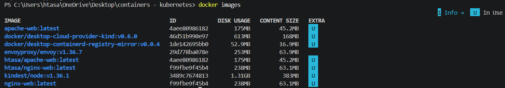
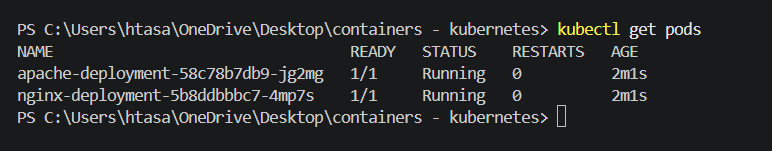
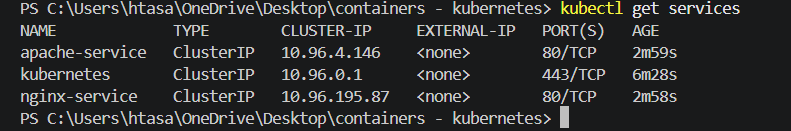
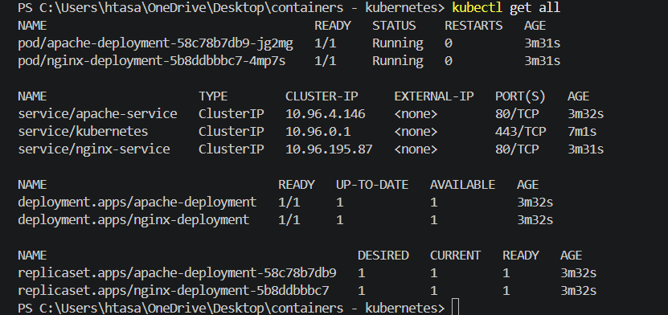
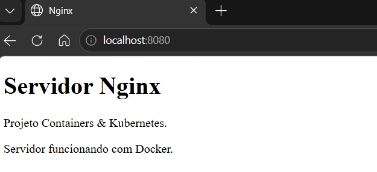
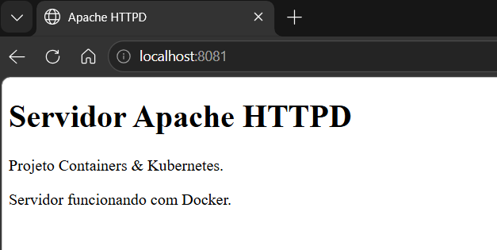

# 📦 Containers & Kubernetes

> Projeto desenvolvido para demonstrar a criação de imagens Docker,
> Publicação no Docker Hub e implantação de aplicações utilizando Kubernetes.


## 🎥 Vídeo de apresentação

Assista à apresentação do projeto:

➡️ https://www.linkedin.com/...

---

# 📑 Índice

- [📖 Sobre o projeto](#-sobre-o-projeto)
- [🎯 Objetivo](#-objetivo)
- [🛠 Tecnologias utilizadas](#-tecnologias-utilizadas)
- [📂 Estrutura do projeto](#-estrutura-do-projeto)
- [⚙ Arquitetura da aplicação](#-arquitetura-da-aplicação)
- [🚀 Como executar](#-como-executar)
- [📸 Demonstração](#-demonstração)
- [📚 Aprendizados](#-aprendizados)
- [🚀 Melhorias futuras](#-melhorias-futuras)
- [👩‍💻 Autora](#-autora)

---

# 📖 Sobre o projeto

Este projeto foi desenvolvido para praticar conceitos fundamentais de conteinerização e orquestração de aplicações utilizando Docker e Kubernetes.

Foram criadas duas aplicações web independentes:

- Servidor **Nginx**
- Servidor **Apache HTTP Server**

Cada aplicação possui sua própria imagem Docker, publicada no Docker Hub e implantada em um cluster Kubernetes através de Deployments e Services.

Durante o desenvolvimento foram utilizados conceitos como:

- criação de imagens Docker;
- Dockerfiles personalizados;
- publicação de imagens no Docker Hub;
- criação de Deployments;
- criação de Services;
- gerenciamento de Pods;
- acesso às aplicações utilizando Port Forward.

---

# 🎯 Objetivo

O objetivo deste projeto é demonstrar o fluxo completo de implantação de aplicações conteinerizadas utilizando Kubernetes.

Além da implantação dos containers, o projeto apresenta uma estrutura organizada para documentação, facilitando a compreensão e reprodução do ambiente.

---

# 🛠 Tecnologias utilizadas

- Docker
- Docker Hub
- Kubernetes
- Nginx
- Apache HTTP Server
- HTML5
- Git
- GitHub
- Visual Studio Code

---

# 📂 Estrutura do projeto

```text
containers-kubernetes/
│
├── apache/
│   ├── Dockerfile
│   └── html/
│       └── index.html
│
├── nginx/
│   ├── Dockerfile
│   └── html/
│       └── index.html
│
├── docs/
│   └── imagens/
│
├── k8s/
│   ├── apache-deployment.yaml
│   ├── apache-service.yaml
│   ├── nginx-deployment.yaml
│   └── nginx-service.yaml
│
├── .gitignore
└── README.md
```

---

# ⚙ Arquitetura da aplicação

```text
                 Docker Hub
                      │
                      ▼
          +----------------------+
          | Kubernetes Cluster   |
          |                      |
          |  Apache Deployment   |
          |          │           |
          |          ▼           |
          |      Apache Pod      |
          |                      |
          |  Nginx Deployment    |
          |          │           |
          |          ▼           |
          |      Nginx Pod       |
          +----------------------+
                 │         │
                 ▼         ▼
          Apache Service  Nginx Service
                 │         │
                 └────┬────┘
                      ▼
            kubectl port-forward
                      │
        localhost:8081   localhost:8080
```

---

# 🚀 Como executar

## 1. Clonar o repositório

```bash
git clone https://github.com/SEU-USUARIO/containers-kubernetes.git
```

## 2. Entrar na pasta

```bash
cd containers-kubernetes
```

## 3. Aplicar os manifestos Kubernetes

```bash
kubectl apply -f k8s/
```

## 4. Verificar os Pods

```bash
kubectl get pods
```

## 5. Criar o acesso local

### Nginx

```bash
kubectl port-forward service/nginx-service 8080:80
```

### Apache

```bash
kubectl port-forward service/apache-service 8081:80
```

## 6. Acessar no navegador

Nginx

```
http://localhost:8080
```

Apache

```
http://localhost:8081
```

---

# 📸 Demonstração

## Docker Images

As imagens Docker foram construídas localmente e publicadas no Docker Hub para utilização pelo Kubernetes.



---

## Pods em execução

Os Pods representam as instâncias das aplicações gerenciadas pelo Kubernetes.



---

## Services

Os Services permitem o acesso às aplicações dentro do cluster Kubernetes.



---

## Recursos do Cluster

Visão geral dos recursos criados no Kubernetes.



---

## Aplicação Nginx

Página HTML hospedada pelo servidor Nginx.



---

## Aplicação Apache HTTP Server

Página HTML hospedada pelo servidor Apache HTTP Server.



---

# 📚 Aprendizados

Durante o desenvolvimento deste projeto foram praticados conceitos importantes relacionados à conteinerização e orquestração de aplicações.

Principais conhecimentos adquiridos:

- Criação de imagens Docker.
- Construção de Dockerfiles personalizados.
- Gerenciamento de containers.
- Publicação de imagens no Docker Hub.
- Criação de Deployments no Kubernetes.
- Gerenciamento de Pods.
- Configuração de Services.
- Utilização do `kubectl`.
- Acesso às aplicações utilizando `kubectl port-forward`.
- Organização de projetos para documentação técnica utilizando GitHub.

---

# 🚀 Melhorias futuras

Como evolução deste projeto, podem ser implementadas as seguintes funcionalidades:

- Utilização de Ingress para acesso às aplicações.
- Configuração de Load Balancer.
- Uso de ConfigMaps e Secrets.
- Escalonamento automático utilizando HPA (Horizontal Pod Autoscaler).
- Pipeline de CI/CD para publicação automática das imagens.
- Implantação em um cluster Kubernetes na nuvem (AWS, Azure ou Google Cloud).

---

# 👩‍💻 Autora

**Ágata Oliveira**

Desenvolvido como projeto acadêmico para prática de Docker, Docker Hub e Kubernetes.

---

# 📄 Licença

Este projeto possui finalidade exclusivamente educacional.

Sinta-se à vontade para utilizá-lo como referência para estudos.

---

## ⭐ Se este projeto foi útil para você

Considere deixar uma ⭐ no repositório.

Isso incentiva a continuidade do desenvolvimento de novos projetos e materiais de estudo.